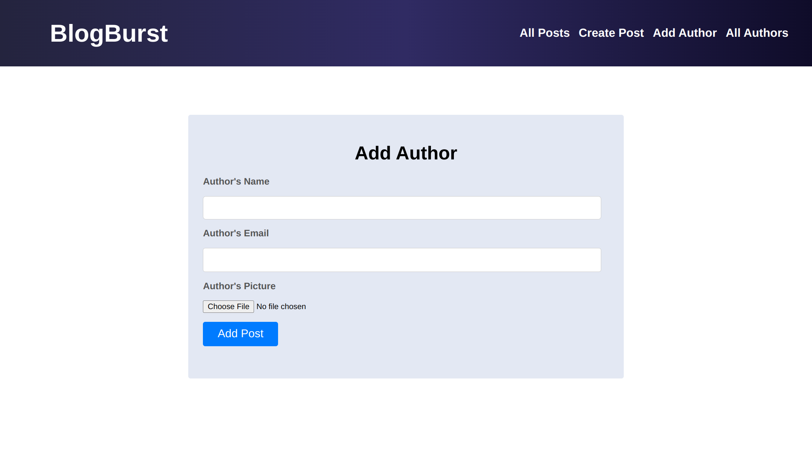

# Blogging Website


## Screnshots



## Overview

This project is a blogging website where users can create, update, and delete their blogs. They can also view a list of all authors and add new authors with pictures. Additionally, viewers can leave comments on the blogs and see them in real-time.

## Technologies Used

- HTML
- CSS
- JavaScript
- MongoDB
- Node.js
- Express.js

## Features

### Blog Management

- **Create Blog:** Users can create new blogs, providing a title, content, and any relevant images.

- **Update Blog:** Users can edit and update their existing blogs, including the option to modify the content and images.

- **Delete Blog:** Users have the ability to delete their blogs if they wish.

### Author Management

- **List Authors:** Users can view a list of all authors on the website.

- **Add Authors:** Users can add new authors, complete with a profile picture.

### Comment System

- **Real-Time Comments:** Viewers can leave comments on blogs, and these comments are displayed in real-time without requiring page refreshes. This is achieved using Socket.io for real-time communication.

## How to Run
1. Clone this repository to your local machine:

   ```bash
   git clone https://github.com/ab7022/blog-site.git\

2. install the repositories:
```bash
   npm install
```
3. Run it
```bash
   npm start
```

5. Open your web browser and visit `http://localhost:3000` to access the blogging website.

## Usage

- **User Registration:** Users can register on the website to create and manage their blogs.

- **Creating Blogs:** Logged-in users can create new blogs by providing the title, content, and images.

- **Updating Blogs:** Users can edit and update their existing blogs.

- **Deleting Blogs:** Blogs can be deleted by their respective authors.

- **Viewing Authors:** Users can access a list of all authors on the website.

- **Adding Authors:** Admins or authorized users can add new authors with profile pictures.

- **Commenting:** Viewers can leave comments on blogs, and these comments appear in real-time for all viewers.


## Credits

This project was developed by [Abdul bayees]

